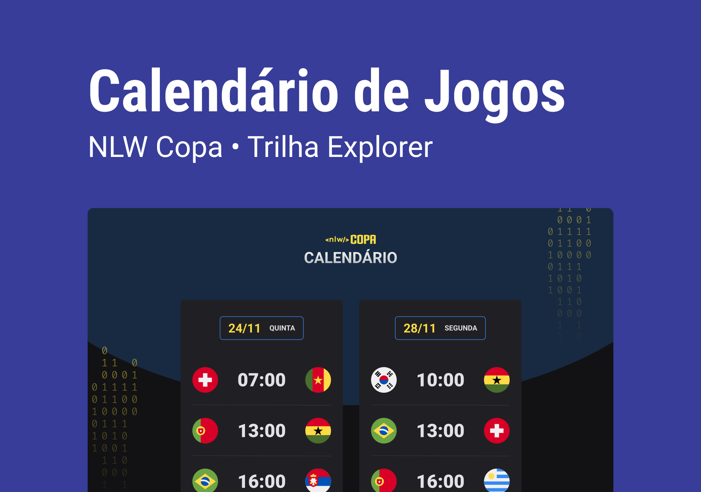

<h1 align="center"> NLW #10 Copa </h1>

Projeto feito na Next Level Week da Rocketseat

  

## Tecnologias

Projeto desenvolvido com as seguintes tecnologias:

- HTML e CSS
- JavaScript
- Git e Github

## Projeto

O projeto Calendário da copa mostra os jogos da copa de 2022

## Layout

Você pode visualizar o layout do projeto através [DESSE LINK](https://www.figma.com/community/file/1169028052212317700). É necessário ter conta no [FIGMA](https://www.figma.com/) para acessá-lo.

---

Feito por Jairo Sousa
